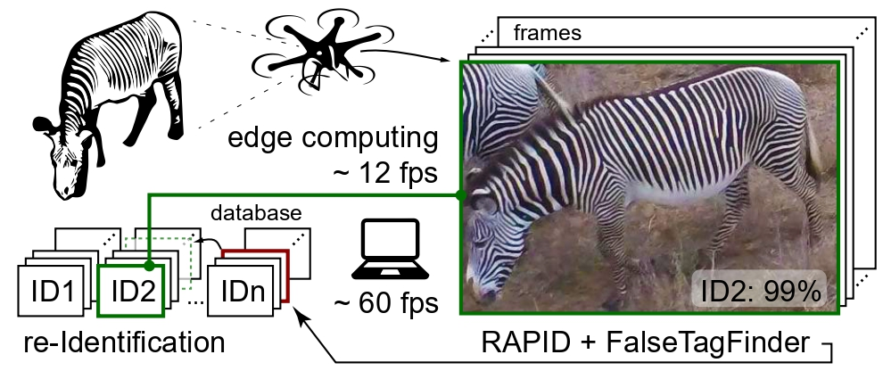

# RAPID: Real-time Animal Pattern re-Identification on edge-Devices

---

---
## What is RAPID?
RAPID is a patterned animal reID (re-identification) modul we developed to support animal reID on edge.
The algorithm is accurate, fast, lightweight and easy to deploy.
The pipeline is streamlined to contain only the essential components for accuracy, ensuring high query throughput without unnecessary complexity and computational needs.

- `RAPID.py` predicts IDs for query animals based on a set of database images
- `FalseTagFinder.py` is an additional feature, which helps researchers to identify potentially wrong labels within ground truth databases

Check out our video abstract [here](https://youtu.be/xGas3IlLrVo).

---
### Accuracy

| Benchmark dataset                                                                                                                      | Top-1 accuracy |
|----------------------------------------------------------------------------------------------------------------------------------------|----------------|
| [StripeSpotter](https://dl.acm.org/doi/abs/10.1145/1991996.1992002)                                                                    | 99 %           |
| [ATRW](https://arxiv.org/abs/1906.05586)                                                                                               | 95 %           |
| [AerialCattle](https://openaccess.thecvf.com/content_ICCV_2017_workshops/w41/html/Andrew_Visual_Localisation_and_ICCV_2017_paper.html) | 99 %           |
| [GiraffeZebraID](https://aaai.org/papers/15245-15245-animal-population-censusing-at-scale-with-citizen-science-and-photographic-identification/)                                                                                                                       | 89 %           |

### Speed (solely on CPU)
| Hardware       | Query processing |
|----------------|------------------|
| PC             | ~ 60 fps         |
| Laptop         | ~ 50 fps         |
| Edge           | ~ 10 fps         |
- PC - DELL Precision 3630 Tower with Intel(R)492 Xeon(R) E-2174G@ 3,80GHz CPU, 8 cores, 63 GB RAM
- Laptop - VivoBook-ASUSLaptop X513UA-M513UA with AMD Ryzen 7 5700U, Radeon Graphics, 16 cores, 16 GB RAM
- Edge - Texas Instruments SK-TDA4VM with ARM Cortex-A72, 2 cores, 2.25 GB RAM
---
## Installation
- open a terminal
- navigate to the directory in which you want to install RAPID. Run the below commands:
- `git clone ...`
- `python3 -m venv venv`
- `source venv/bin/activate`
- `pip install -r requirements.txt`
---
## How to use
- **_RAPID_**:
  - open `RAPID.py`
  - provide database path in line 122: `database_path = 'data/demo/database'`
    - database image names must follow the convention: animalID_viewpoint_frameID.jpg
    - if viewpoint is not known, give arbitrary string in the middle
    - examples: jaguar7_left_23.jpg, tiger18_unknownvp_54.jpg, giraffe74_right_32.jpg
  - provide query path in line 123: `query_path = 'data/demo/query'`)
  - run `RAPID.py`
  - results are saved under `saved` directory
    - query filenames are modified, containing the predicted ID
    - example: `query1.jpg` --> `PRED-ID17_query1.jpg`

- **_FalseTagFinder_**:
  - open `FalseTagFinder.py`
  - provide database path in line 127 `ground_truth_database = 'data/demo/ground_truth_database'` 
  - results will be saved to `saved/potential_false_labels` 

---
## Limitations
- **Patterned animals**
  - RAPID only works with patterned animals
- **Database and query images**
  - RAPID works with images that are cropped bounding boxes of
  individuals or at least one animal occupies most of the image
  - Low resolution, blur, and more than one animals in one image can also cause wrong predictions
- **Closed set scenario**
  - RAPID is not yet capable of identifying new individuals that are not within the database. So query animals should already be represented within the database
- **Viewpoints**
  - For successful predictions, there should be similar viewpoint in the database about the query animal as the query viewpoint 
---
## Cite
bioRxiv paper citation needed
