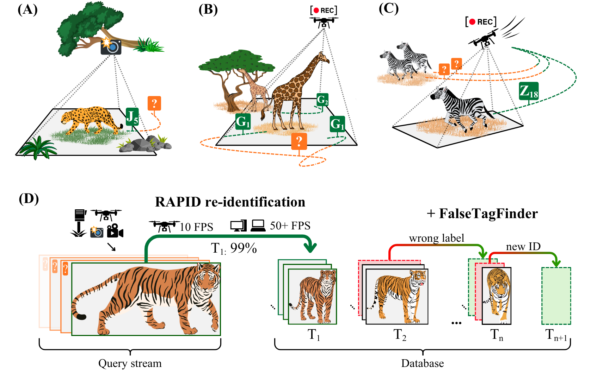

### Version 2.0 released — installation and usage have changed.

---

# RAPID: Real-time Animal Pattern re-Identification on edge-Devices

## What is RAPID?

_RAPID is a patterned animal re-identification (reID) tool. It is easy-to-use, fast and accurate.
Furthermore, suitable for edge deployment (e.g. drones) and integration into larger pipelines (e.g.
autonomous monitoring)._

_The tool has two main features: **1) RAPID** predicts IDs (with confidence scores)
for query animals based on a set of database images, and **2) FalseTagFinder** supports researchers to identify
potentially wrong ID labels within ground truth databases._

For more, read our [preprint](https://doi.org/10.1101/2025.07.07.663143) and watch
the [video abstract](https://youtu.be/xGas3IlLrVo).

<blockquote>

## :tada: Benefits:

</blockquote>

- accurate ID predictions + confidence scores :dart:
- real-time processing (even without GPU) :zap:
- optimal for edge devices, e.g. drones :herb:
- works with multiple species :earth_americas:
- no need for large training data :camera:
- localizable keypoints for visual verification :eyes:

<blockquote>

## :heavy_exclamation_mark: Limitations:

</blockquote>

- works with patterned animals
- needs cropped bounding boxes (however, not necessarily very tight)
- not automated for open-set scenarios (however, can be used as a supporting tool)

<blockquote>

## :chart_with_upwards_trend: Performance:

</blockquote>

Top-1 accuracies on publicly available benchmark datasets:

| Accuracy (Top-1) | Species                                          | Dataset                                                                                                                                          |
|------------------|--------------------------------------------------|--------------------------------------------------------------------------------------------------------------------------------------------------|
| 99%              | :zebra:  Plains and Grevy's zebra                | [StripeSpotter](https://dl.acm.org/doi/abs/10.1145/1991996.1992002)                                                                              |
| 95%              | :tiger2: Amur tiger                              | [ATRW](https://arxiv.org/abs/1906.05586)                                                                                                         |
| 99%              | :cow2: Holstein Friesian Cattle                  | [AerialCattle](https://openaccess.thecvf.com/content_ICCV_2017_workshops/w41/html/Andrew_Visual_Localisation_and_ICCV_2017_paper.html)           |
| 89%              | :giraffe: :zebra: Masai giraffe and Plains zebra | [GiraffeZebraID](https://aaai.org/papers/15245-15245-animal-population-censusing-at-scale-with-citizen-science-and-photographic-identification/) |
| 99%              | :zebra: Grevy's zebra                            | _dataset coming soon..._                                                                                                                         |
| 100%             | :leopard: Jaguar                                 | _dataset coming soon..._                                                                                                                         |

Query processing speed (FPS). Query processing time meant time spent from loading the raw bounding box until
ID prediction and confidence
score calculation.

| Hardware             | Speed (FPS) |
|----------------------|-------------|
| :desktop_computer:PC | ~60 FPS     |
| :computer:Laptop     | ~50 FPS     |
| :herb:Edge           | ~12 FPS     |

Hardware used for tests: 1) PC - DELL Precision 3630 Tower with Intel(R)492 Xeon(R) E-2174G@ 3,80GHz CPU, 8 cores, 63 GB
RAM; 2) Laptop - VivoBook-ASUSLaptop X513UA-M513UA with AMD Ryzen 7 5700U, Radeon Graphics, 16 cores, 16 GB RAM; 3)
Edge - Texas Instruments SK-TDA4VM with ARM Cortex-A72, 2 cores, 2.25 GB RAM

<blockquote>

## :gear: How to install

</blockquote>

####  LINUX: 

1. Click on `Download ZIP` under `Code` and extract the file. Or in terminal:
   `git clone https://github.com/robot-perception-group/Real-time_Animal_reID.git`
2. Extract the zip file, go to `scripts` directory, right click and `open a terminal`, so you see `.../scripts$`
3. In terminal, type: `chmod +x install_on_linux.sh`
4. To install RAPID, type: `./install_on_linux.sh`

####  WINDOWS

1. Click on `Download ZIP` under `Code` and extract the file. Or in command prompt:
   `git clone https://github.com/robot-perception-group/Real-time_Animal_reID.git`
2. Extract the zip file and go to `scripts` folder and double-click on `install_on_windows` to install RAPID

<blockquote>

## :rocket: How to run

</blockquote>

0. **Prepare images** (as an example, see or use demo images: `.../data/demo`)
    1. Images should be cropped bounding boxes
    2. Rename your files precisely following the naming convention: **animalID_viewpoint_frameID.filetype** (just as
       demo
       data)
        1. if animalID is not known, give arbitrary string (e.g. unknownID1)
        2. if viewpoint is not known, give arbitrary string in the middle (e.g. unknownvp)
        3. examples: jaguar7_left_23.jpg, tiger18_unknownvp_54.png, unknownID74_right_32.jpg

####  LINUX: 

1. **Set config**
    1. provide database and query paths in `.../config/config_RAPID.yaml` (or `config_FalseTagFinder.yaml`)
    2. make sure that your paths do not end with `/`
    3. save changes
2. **Activate virtual environment**
    1. in `Real-time_Animal_reID` directory open a terminal, so you see `.../Real-time_Animal_reID$`
    2. in terminal: `source .venv/bin/activate`, as a result, you should see `(.venv)` at the beginning of the command
       line
3. **Run**
    1. in terminal, type: `RAPID` (or `FalseTagFinder`)
    2. check results under `.../saved_RAPID` (or `.../saved_FalseTagFinder`) next to your database dir

####  WINDOWS: 

1. **Set config**
    1. provide database and query paths in `...\config\config_RAPID.yaml` (or `...\config_FalseTagFinder.yaml`)
    2. change every `\` in your paths to single `/` or to double `\\`
    3. make sure that your paths do not end with `\`, `\\`, or `/`
    4. save changes
2. **Activate virtual environment**
    1. open command prompt and type: `conda activate rapid_env`, as a result, you should see `(rapid_env)` at the beginning of the
       command line
3. **Run**
    1. in command prompt, type: `RAPID` (or `FalseTagFinder`)
    2. check results under `...\saved_RAPID` (or `...\saved_FalseTagFinder`) next to your database dir

<blockquote>

## :memo: How to interpret results csv

</blockquote>

- In general, use only first 5 columns
    - `query_img` column helps you identify the given image
    - `provided_ID` is the first part of the query image filename (see above `How to run` section)
    - `predicted_ID` is the prediction of RAPID
    - `confidence_score` is the confidence of the prediction
    - `ID_matching` checks if provided query animal ID from the filename is the same as the prediction. This is only
      meaningful, if you used proper
      animal IDs in the query image filenames that are part of your database
- other columns provide information about top 5 predictions and their weights that can be used for deeper analysis

<blockquote>

## :books: Cite

</blockquote>

Zábó, A., Nagy, M., & Ahmad, A. (2025). RAPID: Real-time Animal Pattern re-Identification on edge Devices.
*bioRxiv*: https://doi.org/10.1101/2025.07.07.663143
